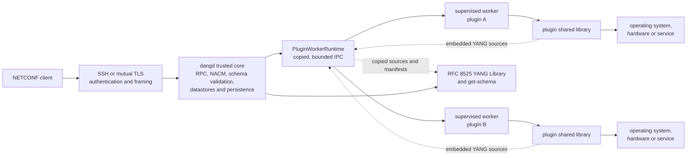
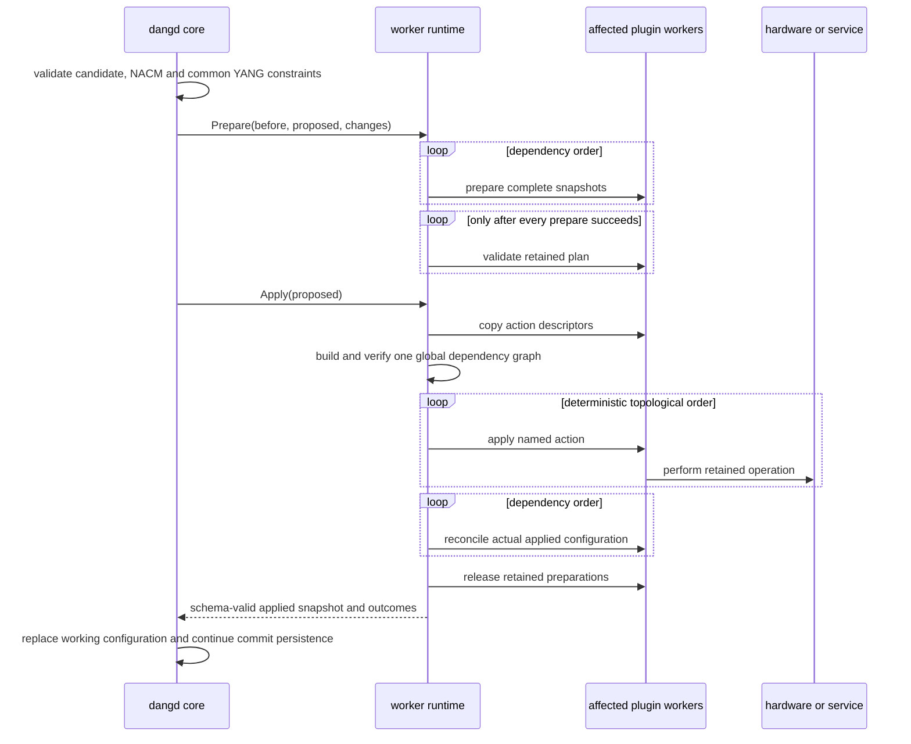
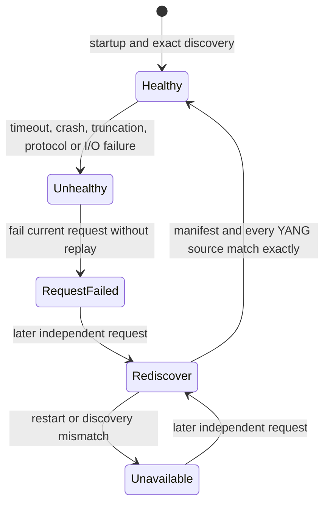

<!-- Copyright 2026 David Cornejo -->
<!-- SPDX-License-Identifier: Apache-2.0 -->

# Writing a dangd configuration plugin

This guide is the implementation contract for plugin ABI versions 1 through
8. It describes the current supervised-worker architecture, shows how a plugin
participates in schema discovery and transactions, and gives concrete guidance
for production providers. The public ABI is declared in
`dangd/plugin_api.h`; when prose and declarations appear to disagree, treat
that header as the type-level authority and report the documentation defect.

## Architecture at a glance



The trust boundary is deliberately narrow. `dangd` owns protocol and datastore
semantics. Each plugin shared library is loaded in its own worker process, and
only copied manifests, YANG text, transaction snapshots, action descriptions,
results, and errors cross the framed channel. The worker boundary contains
crashes and enforces time and size limits, but it is not a privilege sandbox.

## Process ownership

Plugin isolation uses one long-lived supervised worker per
plugin. The worker owns the shared library, callback table, context, prepared
transactions, and every other opaque plugin pointer for their complete
lifetime. `dangd` exchanges only bounded copied values over a deadline-aware
framed POSIX channel; it must never deserialize or retain a worker address.

The framing foundation rejects oversized messages before allocation, applies a
single monotonic deadline across each complete frame, and distinguishes a clean
worker exit from timeout, protocol truncation, and host I/O failure. Live
callback routing uses this worker path. After a worker failure, the failed
request is reported without replay. A later independent request starts a new
worker and uses it only if rediscovery exactly matches the manifest and YANG
sources accepted at daemon startup.
The installed `libexec/dangd/dangd-plugin-worker` executable already owns load,
ABI validation, manifest copying, and YANG source copying for one plugin. Its
ready handshake reports load failures before it accepts requests, and malformed
or unknown operations fail closed without publishing partial discovery data.
The parent supervisor applies separate startup and callback deadlines. Its
operational command copies and revalidates every returned field against host
resource limits, and a timeout, crash, truncation, or invalid response makes the
worker permanently unhealthy before it is killed and reaped. Requests to one
stateful plugin worker are serialized.

Transaction preparation and validation are separate worker requests. Prepare
copies the before/proposed snapshots and change description into the worker and
retains the plugin's opaque preparation there. The parent coordinator prepares
every affected plugin before asking any of them to
validate. Abort releases the retained object without returning its address;
validation rejection also releases it and returns only bounded attribution.
Hardware action descriptors are copied from the worker so the parent can build
one dependency graph across every affected module. The parent then sends named
apply or rollback requests while the opaque preparation remains in the worker.
Plugins older than ABI v4 appear as one synthetic `transaction` action, so they
use the same global planning path. The worker coordinator qualifies local action
dependencies, adds edges from a dependent module to every action of its provider,
rejects duplicate module ownership, and uses the common planner for deterministic
execution and reverse rollback. ABI-v6 reconciliation
callbacks already run inside the worker and return only bounded copies of the
actual configuration and per-node outcomes. The parent validates those copies
against the runtime schema, limits changes to modules owned by the reporting
plugin, rejects duplicate outcome paths, and retains rollback capability until
every affected report is accepted.

Schema-authorized RPCs and actions are dispatched through the same serialized
worker channel. Module and operation names, instance paths, and input XML are
bounded before transmission; output XML and attributed errors are copied and
revalidated by the parent. The plugin never receives transport credentials or
an unchecked NETCONF request.

The internal server-facing `PluginRuntime` contract separates datastore and
NETCONF code from plugin ownership. Production daemon startup uses
`PluginWorkerRuntime`; `PluginManager` is the worker-side loader and is also
used directly by focused tests. It is not an alternate deployment mode or a
plugin-author API. `PluginWorkerRuntime` validates
copied discovery and dependency graphs, expands affected modules, prepares every
worker before validation, coordinates hardware and reconciliation, aggregates
operational fragments, and selects operation owners without loading plugin code.

This guide defines the contract between `dangd` and a dynamically loaded
configuration provider. It is both a how-to and the behavioral specification
for plugin authors. The ABI targets POSIX shared libraries only. Windows
loading and ABI conventions are intentionally out of scope.

## Capability progression

Each newer entry table contains the complete preceding table as its first
member. Export the highest version your plugin fully implements; do not export
later entry points with placeholder callbacks.

```mermaid
flowchart LR
  v1[ABI v1<br/>models, dependencies,<br/>prepare/validate/apply/rollback]
  v2[ABI v2<br/>RPC and action invocation]
  v3[ABI v3<br/>selected operational data]
  v4[ABI v4<br/>fine-grained hardware actions]
  v5[ABI v5<br/>operational completeness]
  v6[ABI v6<br/>actual applied-state reconciliation]
  v7[ABI v7<br/>exclusive resource domains]
  v8[ABI v8<br/>modeled event notifications]
  v9[ABI v9<br/>peer candidates and verification]
  v1 --> v2 --> v3 --> v4 --> v5 --> v6 --> v7 --> v8 --> v9
```



## Responsibilities

`dangd` owns transport authentication, NETCONF framing and RPC processing,
datastore locks, candidate construction, common YANG validation, NACM
enforcement, transaction coordination, persistence, and RFC 8525 YANG Library
publication. A plugin owns the implementation-specific behavior for one or
more YANG modules: hardware checks, external resource checks, preparation,
application, and rollback.

Every implemented module has exactly one owning plugin. One plugin may own a
closely related family of modules. Multiple plugins may supply the same
byte-identical import-only module, but they may not both claim its
implementation.

Different module families can still control the same underlying resource.
ABI v7 providers declare each exclusive lowercase resource token through
`resource_domain_count` and `resource_domain_at`. Dangd copies and validates
the declarations during discovery and rejects duplicate ownership both for
in-process plugins and across supervised workers. `routing` is the canonical
domain for providers that program the host routing plane. Claims are exclusive
for the entire loaded provider lifetime; they are not locks acquired only
during a transaction.

NACM is deliberately not a plugin. `ietf-netconf-acm` configuration is stored
in the normal datastores, while `dangd` compiles and enforces the active policy
inside the trusted core.

ABI v9 keeps peer topology policy in plugins without giving a plugin transport
authority. After ordinary `prepare` and `validate`, an affected plugin may
return complete module-scoped candidates keyed by stable group and participant
identifiers. Every participant in a group must receive the same module set.
Dangd rejects duplicate module contributions, mixed roles or timeouts,
cross-module XML, incomplete participant coverage, invalid composed data,
groups smaller than two, and groups without exactly one primary. Only after
this generic composition succeeds may the core resolve participant identifiers
through its endpoint/trust configuration and open sessions.

The running backend performs that generic collection and composition as part
of normal commit preparation. It queries only affected plugins, aborts all
retained preparations if candidate retrieval or composition fails, and reaches
no hardware apply in that case. The core now resolves every composed identity
through its private endpoint map, and the generic transaction controller can
bind one group to TLS participants, plugin verifiers, secure tokens, and the
durable journal. Remote execution remains disabled until the NETCONF commit
lifecycle can prevent recursive peer planning and order local persistence with
the distributed decision, with NACM policy and operator-visible reporting.

Several plugins may contribute to one group. Each plugin supplies the complete
image only for modules it owns; dangd combines the non-overlapping images and
validates the resulting candidate against the full schema. The plugin's opaque
JSON verification context is returned only to that same plugin along with
authenticated running and operational replies. Endpoint addresses,
credentials, TLS objects, RPC sequencing, durable decisions, and recovery are
never exposed through the ABI. A plugin must not include dangd-private headers
or rely on an undocumented daemon behavior.

## Build and entry point

Include `dangd/plugin_api.h`, build a `.so` or `.dylib`, and export the
initializer for the highest ABI version implemented. A minimal ABI-v1 plugin
exports this symbol with C linkage:

```cpp
extern "C" const DangPluginV1* dang_plugin_init_v1();
```

The returned table and all strings referenced by it must remain valid until
`destroy` is called or the library is unloaded. Its `abi_version` must match
the exported initializer. The v1 source, prepare, validate, apply, rollback,
and release callbacks are mandatory. Supply both dependency callbacks or
neither. `destroy` is optional. Do not pass C++ standard-library objects,
exceptions, or compiler-specific class layouts across the ABI.

The reference implementation is `dangd/plugins/example_plugin.cc`; CMake
builds it as `dangd_example_plugin`.

The more complete `dang_plugins/plugins/ip_management` provider owns the
normative RFC 8343 `ietf-interfaces` and RFC 8344 `ietf-ip` modules. The build
embeds the pinned YANG sources in `dangd_ip_management_plugin`, so the shared
library remains self-contained. It converts each interface or IP delta into a
retained forward and reverse action plan. Its demonstration `apply` and
`rollback` callbacks print those actions to the daemon's diagnostic stream.
Common parsing and execution live in that external package; native
implementations are isolated in its `linux` and `freebsd` directories. Linux
uses direct acknowledged rtnetlink requests for enabled state, link MTU,
IPv4/IPv6 addresses, and static neighbors. FreeBSD uses native interface ioctls
for enabled state, link MTU, and IPv4/IPv6 addresses and acknowledged native
route-netlink requests for static neighbors. A logging-only backend is selected
on unsupported development hosts.

The daemon needs host networking privileges (normally root, Linux
`CAP_NET_ADMIN`, or an equivalent service grant). Reconciliation occurs only
after the common planner reaches its final action. Linux waits for every kernel
acknowledgement, compensates completed operations in reverse order after a
partial failure, and retains observed flags and MTU until the enclosing
transaction commits or rolls back. A failure is returned to NETCONF. The
native backends do not create interfaces. Linux publishes live link status,
MTU, assigned addresses, complete neighbor-cache entries, and native packet,
octet, error, and drop counters for configured and unconfigured kernel
interfaces. FreeBSD also
publishes native live link status, MTU, assigned addresses, and complete
neighbor-cache entries plus packet/octet/error/drop statistics for every kernel
interface. FreeBSD also repairs missing
or altered configured addresses and neighbors without deleting unrelated kernel
entries. Linux likewise repairs drift in configured address and neighbor entries
without claiming ownership of unrelated kernel state.

For example, start `dangd` with the plugin using the module filename produced
by CMake:

```sh
./build/dangd --model dangd/examples/appliance.yang \
  --config dangd/examples/config.xml \
  --plugin ./build/dangd_ip_management_plugin.so --stdio \
  --username admin
```

An `<edit-config>` that creates `/interfaces/interface[name='eth0']`, enables
IPv4, and adds `192.0.2.1/24`, followed by `<commit>`, produces diagnostic
lines resembling:

```text
ip-management: create /{urn:ietf:params:xml:ns:yang:ietf-interfaces}interfaces/...
ip-management: create /{urn:ietf:params:xml:ns:yang:ietf-ip}ipv4/... with value "192.0.2.1"
```

The paths are the exact schema-qualified paths supplied by `dangd`, rather
than paths reconstructed by the plugin from XML. The regression test
`IpManagementPluginPublishesRfc8344AndPrintsApplyPlan` contains a complete
NETCONF request and verifies model discovery, validation, commit, logging, and
the resulting running configuration.

Plugins that implement YANG RPCs or actions use ABI v2 and export
`dang_plugin_init_v2`. `DangPluginV2` retains the complete ABI-v1 table as its
first member and adds `invoke`. Configuration-only ABI-v1 plugins remain
supported without recompilation.

Plugins that publish operational state use ABI v3 and export
`dang_plugin_init_v3`. `DangPluginV3` preserves the ABI-v2 prefix and adds
`get_operational_data`. The callback returns one self-contained XML data
element or fragment using `DangOperationalDataV1`; the bytes are borrowed and
copied before the callback returns. `dangd` parses each expanded data node as
partial instance data and rejects fragments with unknown schema nodes, invalid
shapes or scalar values, missing list keys, choice conflicts, invalid visible
references, or duplicate instances. After validating each fragment alone,
`dangd` validates each cumulative provider snapshot, seeded with daemon-owned
operational data, in plugin load order. Built-in data is authoritative and
earlier providers take precedence: if a provider
introduces a duplicate singleton, list-key collision, choice conflict, or
another deterministically invalid merge, its entire fragment is omitted.
This includes `unique` constraints across list entries published by different
providers: the later provider is rejected when its explicit values duplicate
an earlier accepted entry. `must` and `when` constraints are also evaluated
across providers once all operands referenced by the expression are visible.
The cumulative snapshot is then composed with the backend's complete applied
configuration context; required leafrefs from provider state to config-true
targets must resolve. If that trusted context cannot be reconstructed, provider
publication fails closed rather than bypassing contextual checks. Constraints
that remain indeterminate because providers
supplied only selected state data are not yet enforced. Accepted data is merged into the read-only operational snapshot
before origin handling, NACM, and RFC 8526 filters. The callback must be
read-only, bounded, and safe to invoke for each retrieval. It must not return
configuration that has not actually been applied.

Returned XML must be NUL-terminated within the configured XML byte ceiling
(16 MiB by default). `dangd` checks that boundary before copying and applies the
normal XML node/depth and schema limits afterward; an oversized result fails
the complete retrieval and is attributed to the provider.

### Paging large provider data

When a native backend offers paging, a provider must use it instead of an
unbounded "get all" operation. Treat the backend cursor as opaque and carry it
forward exactly as documented. A paging loop must bound page size, page count,
total items, accumulated bytes, and elapsed time; reject malformed counts,
oversized pages, and a cursor that fails to advance. Never publish a partial
collection as complete merely because a resource limit was reached. A limit or
backend failure fails the provider retrieval with its module and instance path.

Internal paging protects the native service and bounds intermediate replies; it
does not paginate NETCONF itself. RFC 6241 and RFC 8526 retrievals still produce
one logical RPC reply after filtering and NACM. If that reply exceeds dangd's
ceiling, it fails rather than being silently truncated. Any future client-visible
pagination must be an explicitly advertised extension with snapshot consistency,
opaque continuation tokens, expiry, and NACM applied independently to every
page.

The current worker runtime serializes callback requests. Plugin authors should
not depend on that as a permanent ABI guarantee: synchronize plugin-created
threads and external callbacks, and keep per-response storage valid until the
callback returns. Never return storage that an asynchronous task may mutate.

ABI v5 extends the complete ABI-v4 table with `get_operational_data_v2` and
`DangOperationalDataV2`. A provider sets `complete` to nonzero only when every
returned element contains its complete child collection at the instant of the
callback. Omitted children are then known to be absent, so mandatory children
and required leafrefs between siblings are enforced. Leave `complete` zero for
filtered, paged, cached-partial, or collaboratively published subtrees. ABI v3
and v4 callbacks always retain selected-data semantics. A false completeness
assertion can cause valid state to be rejected and violates the plugin contract.
Completeness follows each canonical data instance, including list keys and
leaf-list values; it is never inferred for a separate instance merely because
the instances share a schema node.
Selected fragments may leave absence-sensitive constraints indeterminate;
omission then means "not supplied", not "absent". A provider that owns the
complete current child set must assert completeness so dangd can enforce
mandatory nodes and required references decisively.

ABI v6 extends ABI v5 with `reconcile_applied_configuration`. Dangd calls it
after successful hardware application and before releasing the prepared
transaction. `current_xml` is the complete applied snapshot accepted from the
proposed configuration and all earlier dependency-ordered plugins. Return a
complete schema-valid `applied_xml`; copy `current_xml` unchanged when the
backend applied the request exactly. A plugin may change only nodes belonging
to modules it declares as implemented; cross-module changes fail closed. The
optional outcome array identifies
unique canonical instance paths and one of `APPLIED`, `TRANSFORMED`,
`REJECTED`, or `DELAYED`. Never report desired values as applied. Invalid XML,
unknown dispositions, and duplicate path claims fail the commit and invoke
rollback callbacks in reverse dependency order.

The returned XML may attach `ietf-origin:origin` metadata to configuration
nodes when the backend knows their real source. Values may be any identity
derived from `ietf-origin:origin`, including `default`, `system`, `learned`,
`dynamic`, and `unknown`; dangd rejects an undeclared prefix, unrelated
identity, or origin annotation on invalid instance data. Descendants inherit a
parent annotation according to RFC 8342, and dangd supplies `intended` only
where the applied source did not provide a more specific origin.

A failed callback or rejected fragment is omitted and reported under
`dangd-reconciliation:hardware-reconciliation/operational-provider-failure`.
The record identifies the plugin, callback, validation, or merge stage, best
available instance path, and reason. Providers should still log platform
failures locally; the telemetry describes the current retrieval and is not a
durable event log. A NETCONF `<get>` or operational `<get-data>` that encounters
one of these failures returns an `operation-failed` RPC error with application
tag `operational-provider-failure`; its error path and message identify the
best available path, provider, stage, and reason. The RPC does not return a
partially assembled operational data payload alongside that error.

The IP-management example exports ABI v4 and uses its embedded ABI-v3 callback
to publish RFC 8343 `/interfaces-state`. Linux and FreeBSD inventory all kernel
interfaces, publish native counters, and read flags, MTU, addresses, and
ARP/IPv6 neighbor caches from the kernel for each retrieval. Linux rtnetlink
and FreeBSD IPv6 address
flags supply RFC 8344 preferred, deprecated, tentative, and duplicate status;
Linux additionally reports optimistic status and FreeBSD detached addresses as
inaccessible.
Unsupported development platforms derive `oper-status` from the last
successfully applied configuration.

Load plugins explicitly:

```sh
dangd --model appliance.yang --config config.xml \
  --plugin /usr/lib/dangd/plugins/example_plugin.so --check
```

Plugin initialization and model discovery happen before `dangd` accepts a
connection. After schema validation and optional snapshot restore, dangd
presents the complete effective running tree as a change from an empty baseline
to every affected plugin. Providers prepare, validate, and apply before their
dependents. This happens even when a restored tree is byte-for-byte identical
to the packaged initial configuration, so a plugin must treat startup apply as
idempotent reconciliation with the actual device rather than assume that no
ordinary NETCONF delta means no work is required. Startup fails if any phase
fails; a first-boot state snapshot is not published until activation succeeds.

## Supplying YANG sources

`yang_source_count` and `yang_source_at` return `DangYangSourceV1` records.
Return complete immutable source bytes, not just a pathname. This keeps the
plugin relocatable and ensures that the schema being compiled is exactly the
schema being advertised.

Each source has one role:

- `DANG_YANG_IMPLEMENTED_V1`: the plugin implements protocol-visible behavior.
- `DANG_YANG_IMPORT_ONLY_V1`: definitions are needed only by imports/includes.
- `DANG_YANG_DEVIATION_V1`: deviations alter implemented schema conformance.

`module_name` and `revision` must agree with the declarations in the supplied
source. `source_uri` is optional provenance and is published as an RFC 8525
location. A URI does not replace the source bytes. `enabled_features` names
the features enabled for an implemented module; `dangd` rejects unknown names
and publishes the accepted set in YANG Library.

`dangd` copies every descriptor and source before completing plugin discovery.
It combines implemented plugin modules with core modules and the root model,
resolves the complete import/include closure, and compiles one effective
schema. Startup fails on invalid YANG, unresolved imports, incompatible
revisions, duplicate implementation ownership, or invalid deviations.

The resulting inventory is returned by NETCONF `<get>` under
`/ietf-yang-library:yang-library`. It includes implemented and import-only
modules, revisions, namespaces, submodules, locations, datastore mappings, and
a content identifier. `<get-config>` does not return this operational data.

The configured plugin paths are reloaded on POSIX `SIGHUP`. `dangd` stages
fresh shared-library images, compiles the complete replacement schema, and
validates the current running configuration against it before publication. A
failed reload leaves the current schema, plugins, and datastore untouched. A
successful reload changes the RFC 8525 content identifier, publishes
`yang-library-update`, and makes the new schema active for subsequent
sessions. Existing TLS sessions are notified and closed so they cannot keep
using the superseded schema negotiated in their server hello.

Every advertised module and submodule can be retrieved from the daemon with
the RFC 6022 `get-schema` operation in YANG format. The returned bytes are the
same immutable sources used for compilation.

## RPC and action dispatch

An ABI-v2 plugin's `invoke` callback receives `DangOperationV1` after `dangd`
has resolved the operation against the plugin's implemented YANG module and
completed NACM authorization and validated its input against the compiled
schema. `module_name` and `operation_name` identify the
schema node, `input_xml` is a self-contained request element, and
`instance_path` is non-null only for an action. For actions, `dangd` has also
verified read access to every ancestor data instance.

Return application output as one self-contained XML fragment through
`DangOperationResultV1.output_xml`. The string is borrowed only for the
duration of the callback and is copied immediately. `dangd` applies NACM read
filtering in the operation's output-schema context before serializing the RPC
reply. Invalid or incomplete output is rejected as a plugin failure. Return
zero and populate
`DangPluginErrorV1` for an application failure. A plugin that owns a module but
does not provide `invoke` receives `operation-not-supported` for that module's
RPCs and actions.

Authentication, NACM, schema dispatch, and NETCONF error serialization must
not be duplicated in the callback. The plugin should perform only the actual
module operation and return its result.

## Event notification publication

An ABI-v8 plugin exports `dang_plugin_init_v8` and supplies
`next_notification`. Dangd polls this nonblocking callback: return `1` with one
event, `0` when the queue is empty, or `-1` with `DangPluginErrorV1` when the
provider cannot inspect its event source. Never wait in this callback; retain
backend watches or file descriptors in plugin context and report only events
that are already available.

Each successful result supplies the registered stream name, implemented module
name, modeled notification name, and one self-contained XML element containing
the notification body. A data-associated notification also supplies its
complete schema-qualified `instance_path`. Set `default_deny_all` only for an
additional provider policy; annotations in the compiled YANG schema are always
enforced by the host.

All returned pointers are borrowed for the callback duration. The worker copies
and bounds every string, and the trusted core then verifies that the claimed
module and notification match the XML root and compiled schema. It validates
the content, resolves any data-associated instance, applies subscription
filters and NACM independently for each session, and constructs the RFC 5277
wrapper and event time. Plugins must not construct that wrapper, inspect user
credentials, make NACM decisions, or address individual subscribers. Invalid
events fail closed and are reported in daemon diagnostics.

## Runtime dependencies

`dependency_count` and `dependency_at` name implemented modules whose provider
must precede this plugin. These are runtime dependencies, not ordinary YANG
imports. Importing a typedef or identity does not create a runtime dependency.

Dependencies serve two purposes:

1. A change to a dependency also marks the dependent plugin as affected.
2. Dependency providers are prepared and validated before their dependents;
   the hardware planner makes all provider actions prerequisites of every
   dependent action.

The initial ABI rejects missing providers and cyclic runtime dependencies.
Model relationships that form a cycle must therefore be validated from the
common proposed tree without declaring a cyclic apply dependency. ABI v4 also
permits finer ordering across modules. A dependency without `:` is local to the
declaring plugin. A fully qualified `plugin-name:action-id` dependency can name
another plugin's action; the target must be present in the same affected
transaction or planning fails.

## Transaction input

An affected plugin receives one `DangTransactionV1` containing:

- `before_xml`: the complete current running configuration.
- `proposed_xml`: the complete validated configuration that would become
  running.
- `changes_json`: exact schema-aware changes with module, path, kind, before,
  and after values.

All affected plugins receive the same immutable snapshots. A plugin should
read its own module data and any dependency data directly from
`proposed_xml`. It must not ask another plugin for a mutable configuration
copy. This is what makes cross-module validation deterministic.

Strings in the transaction are owned by `dangd` and remain valid through
`release`. A plugin must copy anything needed beyond that call.

## Transaction lifecycle

The live worker lifecycle is:



No validation callback runs until every affected plugin has prepared
successfully. On a prepare, validation, planning, apply, or reconciliation
failure, retained objects are released. Completed hardware actions are first
compensated in reverse execution order when necessary; the working datastore is
not replaced unless the full plugin phase succeeds.

### prepare

`prepare` parses relevant configuration, resolves references, calculates an
implementation plan, and may acquire temporary reservations. It returns an
opaque prepared object through `prepared`.

At startup, `before_xml` is an empty NETCONF configuration and `proposed_xml`
is the complete initial or restored running tree. `changes_json` therefore
contains creation events for explicit configured nodes. During an ordinary
commit, both snapshots and the change list describe the actual running-tree
transition. Plugins should always use the complete proposed tree to satisfy
cross-module dependencies and use the change list to plan owned actions.

Preparation must not make externally visible configuration changes. Every
successful preparation must be releasable even if another plugin later fails.

### validate

`validate` checks the prepared plan against module-specific limitations such
as hardware capacity, unsupported combinations, or unavailable dependency
resources. Common YANG constraints have already been checked by `dangd`.

Validation must not mutate externally visible state. It may rely on
reservations made during preparation.

### apply and ABI v4 hardware actions

`apply` performs the exact retained plan. It must not silently reinterpret the
configuration or redo preparation against a different state. Successful apply
must leave the resource representing `proposed_xml`.

An apply operation should be idempotent wherever possible. The plugin must not
return success until its portion of the proposed state is durable enough to
satisfy its documented behavior.

ABI v1-v3 use `apply` and `rollback` as one action for the whole plugin. ABI v4
retains those callbacks for ABI compatibility but supplies
`hardware_action_count`, `hardware_action_at`, `apply_hardware_action`, and
`rollback_hardware_action` for actual commits. Each descriptor has:

- a stable, nonempty action ID unique within the prepared object;
- the affected schema instance path, when known;
- a normal, activate, or deactivate class;
- zero or more local or fully qualified prerequisite action IDs.

Descriptions are copied during planning; callback input remains borrowed.
Action callbacks receive the original local ID. Dangd adds generic safety
edges, rejects missing or cyclic dependencies, and executes a deterministic
topological order. All deactivations precede normal and activation work; all
activations follow other work. For ancestor paths, creation/update proceeds
parent first and deactivation proceeds child first. Plugins must still declare
backend-specific edges such as program-ACL before attach-ACL.

On action failure, only completed actions are rolled back, in reverse execution
order. A rollback failure produces `hardware-state-diverged`; successful
rollback preserves the previous running datastore. Validate dynamic capacities
and reserve any resources needed to ensure that apply will not race preflight.

### rollback

`rollback` is mandatory in ABI v1. If a later plugin fails to apply, `dangd`
calls rollback for already-applied plugins in reverse apply order. Rollback
uses the retained prepared object and must restore the state represented by
`before_xml`.

Confirmed commits are also sent through the backend when cancelled, expired,
or abandoned. The reverse datastore change is prepared, validated, and
applied like any other transaction. A plugin must therefore support both its
explicit rollback callback and an ordinary transaction whose proposed tree is
an earlier configuration.

If rollback itself fails, the plugin should return the most precise error it
can and preserve diagnostic state for reconciliation. `dangd` reports the
original apply failure together with every rollback failure and uses the
`hardware-state-diverged` NETCONF error app-tag. Production providers should
also log rollback failures through their platform facilities because device
state may require reconciliation. The core retains each failed compensation's
action ID, instance path, and reason in the modeled
`dangd-reconciliation:hardware-reconciliation` operational tree. A fully
successful later hardware transaction clears that report. Legacy ABI actions
have an empty path because their transaction-wide callback cannot identify a
more precise instance.

### release

`release` frees the prepared object and all reservations. It is called after a
successful transaction, after validation failure, after apply failure and
rollback, and when the host aborts preparation. It must be safe for every
object returned successfully by `prepare` and must not throw.

## Failure reporting

Return zero from a failing callback and populate `DangPluginErrorV1`:

- `message` describes the implementation failure in user-facing language.
- `instance_path` identifies the responsible YANG instance when known.

`dangd` converts the error into a NETCONF `operation-failed` response that
includes the plugin name, message, module context, and path. Returned strings
must remain valid until the callback returns.

Do not terminate the process, throw across the ABI, write partial error XML,
or modify the candidate/running datastore directly.

## Concurrency and reentrancy

Configuration callbacks execute under the serialized datastore transaction
boundary. A callback must not reenter `dangd`, issue NETCONF operations, or
wait for a request that requires the datastore lock. RPC, action, operational,
and transaction callback requests are currently serialized by the worker
runtime as well. This is an implementation property, not permission to use
unprotected state from plugin-created threads.

Plugins are still responsible for synchronizing their own worker threads and
external callbacks. `destroy` is called only after prepared transactions have
been released.

## Security expectations

A plugin is native code in a supervised child process and normally inherits the
daemon's operating-system privileges and environment. Load only trusted
libraries. The process boundary, ABI checks, copied protocol, and resource
ceilings provide fault containment; they are not a privilege sandbox, code
signature mechanism, or defense against a deliberately malicious plugin.

Plugins must treat all configuration strings as untrusted input even though
they have passed schema validation. They should bound derived allocations,
validate external identifiers, and never include secrets in error messages or
logs.

New implementation code must prefer stable programmatic interfaces—native
libraries, kernel interfaces, or structured daemon protocols—over spawning a
command-line utility. This improves error fidelity, removes locale and output
format dependencies, and makes transaction results easier to attribute. A
command is acceptable only when no suitable programmatic interface exists;
that exception must be documented, must pass fixed validated arguments without
a shell, and must have failure and rollback tests. This rule applies equally
on Linux and FreeBSD; FreeBSD netlink is a candidate for routing and interface
providers and must be evaluated rather than assuming `route(8)` is required.

NACM authorization has already succeeded before plugin preparation. Plugins
must not implement an independent, inconsistent authorization policy for the
same configuration nodes.

## Worker failure and recovery



The supervisor never guesses whether a failed callback performed a side
effect, so it never replays that request. Recovery is attempted only for a
later independent request. The replacement is accepted only when its copied
manifest, capabilities, dependencies, enabled features, and complete YANG
source inventory match the startup discovery exactly. A transaction failure is
therefore visible to the NETCONF client even when a replacement worker can be
started immediately afterward.

## Checklist

Before shipping a plugin, verify that it:

- supplies exact module names, revisions, source sizes, and roles;
- declares only genuine runtime dependencies;
- declares every exclusively controlled non-schema resource when using ABI v7;
- does no visible work during prepare or validate;
- retains one exact apply plan through the transaction;
- classifies activation and deactivation and declares every backend-specific
  action dependency when using ABI v4;
- rolls back every applied operation in reverse-safe form;
- handles a confirmed-commit reversal;
- reports a module path with actionable failures;
- frees every prepared object and reservation;
- is tested for prepare, validation, apply, rollback, and release failures;
- is tested for callback timeout or worker exit without assuming replay;
- returns actual applied state, ownership-safe changes, and unique outcome paths
  when using ABI v6;
- distinguishes complete from selected operational data correctly when using
  ABI v5;
- keeps `next_notification` nonblocking and returns only schema-valid modeled
  event bodies when using ABI v8;
- appears correctly in the RFC 8525 YANG Library response.
